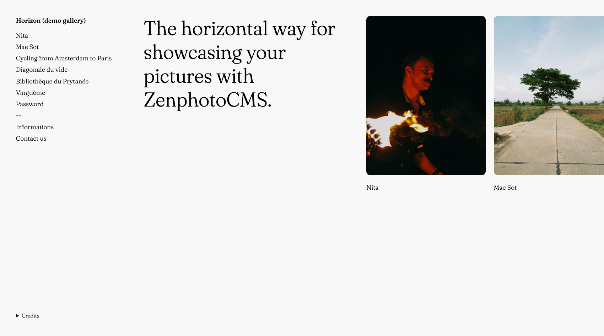

# Horizon, the horizontal way for Zenphoto CMS
A Zenphoto CMS photo gallery theme.
Inspired by the defunct Expositio theme (Wordpress).

## Prerequisite
- You need to activate the `print_album_menu` plugin in order to list albums on the menu.
- You can't use sub-albums, only first-level.
- There is no pagination, you must edit the pictures per page according to your biggest gallery.

## Supported plugins (Not that much)
- zenpage
- contact
- cacheManager
- print_album_menu / **required**
